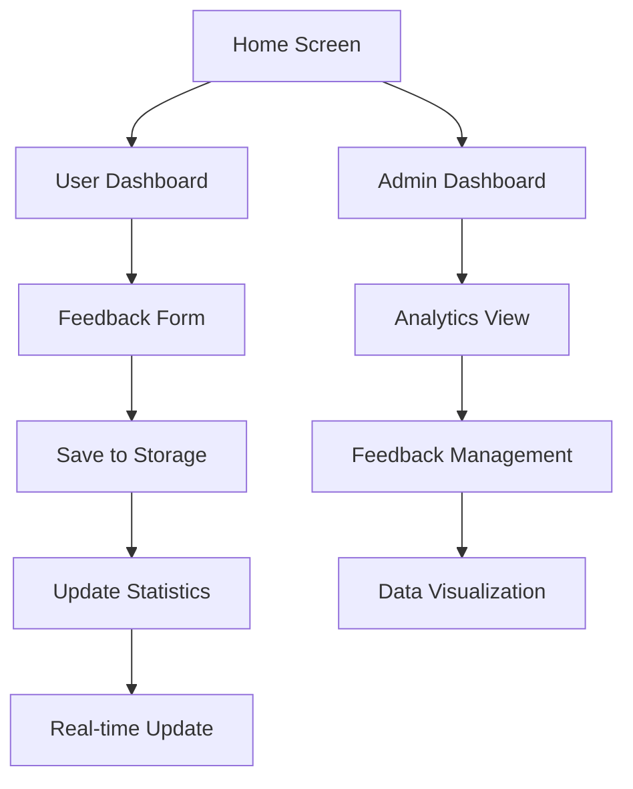

# AKB-LAST: Aplikasi Feedback Management System

## 📋 Deskripsi Proyek

**AKB-LAST** adalah aplikasi manajemen feedback yang dikembangkan menggunakan React Native dengan Expo. Aplikasi ini memungkinkan pengguna untuk memberikan feedback dan admin untuk mengelola serta menganalisis feedback yang masuk dengan tampilan dashboard yang informatif.

---

## 🎯 Latar Belakang dan Tujuan

### Latar Belakang

- Kebutuhan organisasi untuk mengumpulkan feedback dari pengguna secara terstruktur
- Pentingnya analisis sentimen dan data feedback untuk pengambilan keputusan
- Diperlukan sistem yang mudah digunakan baik untuk pengguna maupun administrator

### Tujuan

1. **Mempermudah Pengumpulan Feedback**: Menyediakan interface yang user-friendly untuk input feedback
2. **Analisis Data Real-time**: Memberikan dashboard analitik untuk memahami trend feedback
3. **Cross-Platform Compatibility**: Berjalan di web dan mobile dengan performa optimal
4. **Dark Theme UI**: Menyediakan pengalaman visual yang modern dan nyaman

---

## 🚀 Fitur Utama

### 📱 User Dashboard

- **Feedback Form**: Form lengkap dengan rating, kategori, dan komentar
- **Anonymous Mode**: Opsi untuk memberikan feedback secara anonim
- **Real-time Statistics**: Menampilkan total feedback, rata-rata rating, dan feedback hari ini
- **Category Selection**: Pilihan kategori (Umum, Layanan, Produk, Teknis)
- **Rating System**: Sistem bintang 1-5 untuk penilaian

### 🔧 Admin Dashboard

- **Analytics Overview**: Statistik komprehensif feedback yang masuk
- **Feedback Management**: Melihat, mengelola, dan menghapus feedback
- **Word Cloud**: Visualisasi kata-kata yang sering muncul dalam feedback
- **Category Analytics**: Analisis berdasarkan kategori feedback
- **Rating Distribution**: Grafik distribusi rating
- **Real-time Data**: Update data secara real-time

### 🎨 UI/UX Features

- **Dark Theme**: Tema gelap yang konsisten di seluruh aplikasi
- **Responsive Design**: Optimal untuk web dan mobile
- **Smooth Scrolling**: Scrolling yang mulus di semua platform
- **Modern Interface**: Design modern dengan accent color cyan (#64FFDA)

---

## 🏗️ Arsitektur / Alur Kerja

### Tech Stack

```
📱 Frontend: React Native + Expo SDK 53.0.20
💾 Storage: AsyncStorage (Mobile) + LocalStorage (Web)
🎨 UI Components: React Native + Expo Vector Icons
📊 State Management: React Context API
🔄 Navigation: React Navigation v6
```

### Arsitektur Aplikasi

```
AKB-LAST/
├── 📱 App.js (Main App Component)
├── 📂 src/
│   ├── 🎯 screens/
│   │   ├── HomeScreen.js (Landing Page)
│   │   ├── TestUserDashboard.js (User Interface)
│   │   └── TestAdminDashboard.js (Admin Interface)
│   ├── 🔄 context/
│   │   └── FeedbackContext.js (State Management)
│   ├── 🎨 components/
│   │   └── RealtimeVisualization.js (Data Visualization)
│   └── 🎨 theme.js (Theme Configuration)
├── 🌐 web/
│   └── index.html (Web Template)
└── 📊 web-scrolling-fix.css (Web Optimizations)
```

### Alur Kerja Data

1. **Input Feedback**: User mengisi form → Data disimpan ke Context
2. **Storage**: Data disimpan ke AsyncStorage/LocalStorage
3. **Real-time Update**: Context memperbarui statistik otomatis
4. **Admin View**: Admin melihat data melalui dashboard analytics
5. **Data Visualization**: Word cloud dan charts dirender berdasarkan data

### Flow Aplikasi



---

## 📱 Screenshot Tampilan Aplikasi

### 🏠 Home Screen

```
┌─────────────────────────┐
│  🏠 AKB-LAST            │
│  ─────────────────────  │
│                         │
│   📝 User Dashboard     │
│   [     Button     ]    │
│                         │
│   🔧 Admin Dashboard    │
│   [     Button     ]    │
│                         │
│  Dark Theme dengan      │
│  Navigation yang clean  │
└─────────────────────────┘
```

### 📝 User Dashboard

```
┌─────────────────────────┐
│ 👤 User Dashboard    📊 │
│ ─────────────────────── │
│ 📊 Stats Bar:           │
│  Total | Rata² | Hari ini│
│   15   │ 4.2   │   3     │
│ ─────────────────────── │
│ 🔒 Mode Privasi    [ON] │
│ ─────────────────────── │
│ ⭐ Rating: ⭐⭐⭐⭐⭐   │
│ ─────────────────────── │
│ 📂 Kategori:            │
│ [Umum] [Layanan] [...]  │
│ ─────────────────────── │
│ 💬 Feedback:            │
│ [Text Area]             │
│ ─────────────────────── │
│    [   Kirim Feedback   ]│
└─────────────────────────┘
```

### 🔧 Admin Dashboard

```
┌─────────────────────────┐
│ 🔧 Admin Dashboard   🏠 │
│ ─────────────────────── │
│ 📊 Analytics Cards:     │
│ ┌───────┐ ┌───────────┐ │
│ │Total  │ │Positif    │ │
│ │  15   │ │    8      │ │
│ └───────┘ └───────────┘ │
│ ┌───────┐ ┌───────────┐ │
│ │Negatif│ │Rating     │ │
│ │   2   │ │   4.2     │ │
│ └───────┘ └───────────┘ │
│ ─────────────────────── │
│ ☁️ Word Cloud:          │
│ layanan bagus excellent │
│   👍 mantap   oke       │
│ ─────────────────────── │
│ 📋 Recent Feedback:     │
│ • User A: "Layanan..."  │
│ • Anonymous: "Bagus"    │
│ • User C: "Perlu..."    │
└─────────────────────────┘
```

### 🎨 Design System

```
🎨 Color Palette:
┌─ Background: #0D1421 (Dark Navy)
├─ Cards: #1A2332 (Dark Blue-Gray)
├─ Borders: #263244 (Medium Gray)
├─ Primary Text: #FFFFFF (White)
├─ Secondary Text: #B0BEC5 (Light Gray)
└─ Accent: #64FFDA (Cyan/Teal)

📱 Components:
- Modern card-based design
- Consistent spacing and typography
- Smooth animations and transitions
- Responsive layout for all screen sizes
```

---

## 🌟 Keunggulan Aplikasi

1. **Cross-Platform**: Berjalan optimal di web dan mobile
2. **Real-time Analytics**: Data terupdate secara langsung
3. **User-Friendly**: Interface intuitif dan mudah digunakan
4. **Dark Theme**: Pengalaman visual yang modern dan nyaman
5. **Responsive**: Menyesuaikan berbagai ukuran layar
6. **Local Storage**: Data tersimpan lokal untuk performa cepat
7. **Anonymous Support**: Opsi feedback anonim untuk privasi

---

## 📈 Future Enhancements

- 📊 Export data ke Excel/PDF
- 🔔 Push notifications untuk admin
- 🌐 Multi-language support
- 📱 Native mobile app deployment
- 🔒 User authentication system
- 📊 Advanced analytics dengan charts interaktif

---

**Dikembangkan dengan ❤️ menggunakan React Native + Expo**

_Aplikasi ini mendemonstrasikan implementasi full-stack feedback management system dengan fokus pada user experience dan data visualization._
